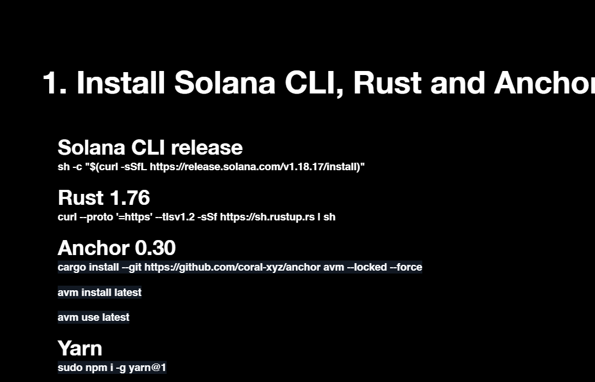
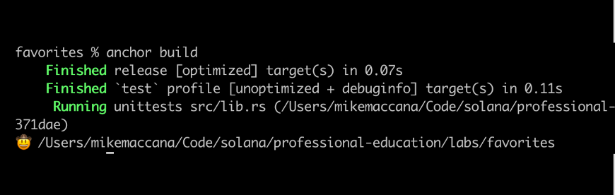

# Q3T_Sol_kelvinfredrick

# WEEK 1
WBA Q3 Solana Builder Cohort Class Training

NFT Devnet Adress: https://explorer.solana.com/address/AAZPMFB1PFhBvB83QNaAWamz551nowSkWWLqo1zuwyq6?cluster=devnet

SPL Devnet Token Address: https://explorer.solana.com/address/pidSF2hfgPqPoa8ehmrzUpt4dmfjZdst4BrCgbJAZ9u?cluster=devnet

# WEEK 2

# Anchor Vault Q3

This project is an Anchor program, Vault.

## Prerequisites

Before you begin, ensure you have the following installed:

- [Node.js](https://nodejs.org/) (v14 or later)
- [Yarn](https://yarnpkg.com/)
- [Rust](https://www.rust-lang.org/tools/install)
- [Solana CLI](https://docs.solana.com/cli/install-solana-cli-tools)
- [Anchor CLI](https://project-serum.github.io/anchor/getting-started/installation.html)

## Project Setup

1. **Clone the Repository**

   ```bash
   git clone https://github.com/kelvinfredrick/Q3T_Sol_kelvinfredrick
   cd anchor_vault_q3
   ```

   ```basb
   yarn install
    ```

    ```basb
    anchor build
    ```

    ```basb
    anchor test
    ```

# WEEK 3

This project is an Anchor program, to create a user's favorite number, color and hobbies and store in the blockchain

   ```bash
   git clone https://github.com/kelvinfredrick/Q3T_Sol_kelvinfredrick
   cd favourites
   ```

   ```basb
   yarn install
   ```




    ```basb
    anchor build
    ```

    ```basb
    anchor test
    ```

all test should pass
